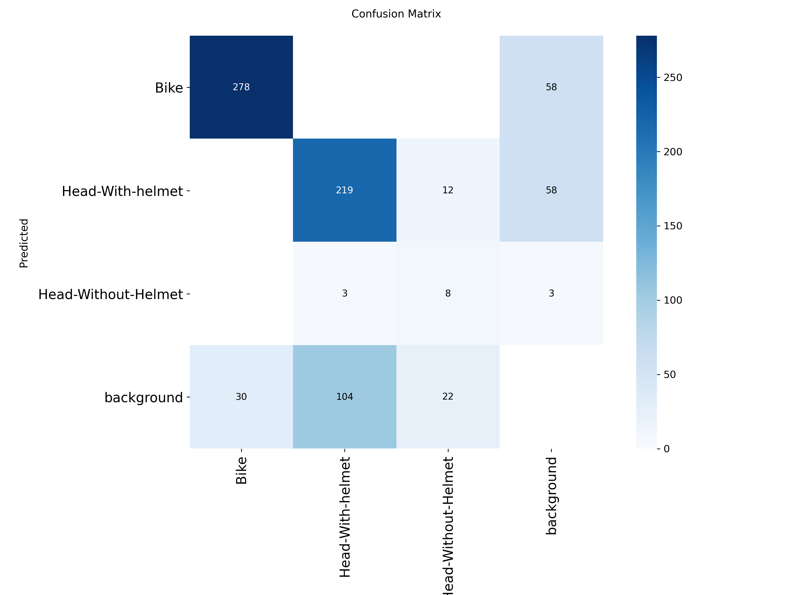
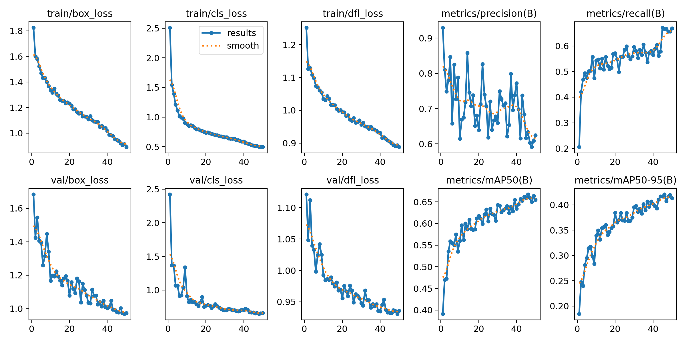

# Helmet & Tripling Detection with YOLOv8


Real-time detection of **bikes**, **helmeted heads**, and **unhelmeted heads** – with **tripling** alerts when >2 heads are on a single bike.

---

## Demo Video


---

### Confusion Matrix


### Precision-Recall Curve & mAP


---

## Dataset

* **Source:** [Roboflow – Helmet Detection](https://app.roboflow.com/hsherpa/helmet-detection-8bftf/1)  
* **Total images:** 2,400  
  * **Train:** 2,100  
  * **Val:**   199  
  * **Test:**  101  

Classes: `Bike`, `Head-With-helmet`, `Head-Without-Helmet`.

---

## Quick Start

```bash
# 1. Clone the repo
git clone https://github.com/Re-surgence/Helmet-and-tripling-detection.git
cd Helmet-and-tripling-detection

# 2. Install dependencies
pip install -r requirements.txt

# 3. (Optional) Train your own model
python src/train.py   # uses data.yaml with the Roboflow paths

# 4. Run inference on a video
python src/infer_video.py \
    --model weights/best.pt \
    --video path/to/your/video.mp4 \
    --output output/my_result.mp4 \
    --conf 0.5
